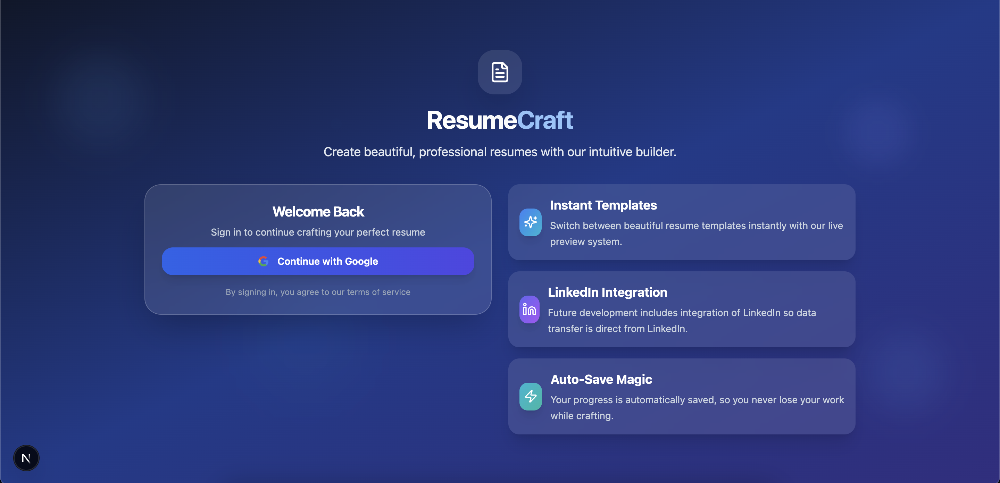
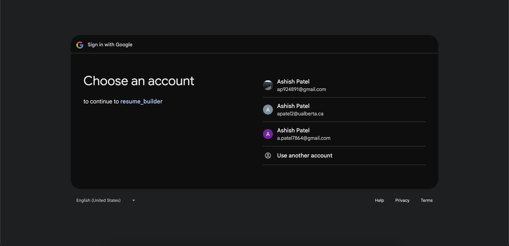
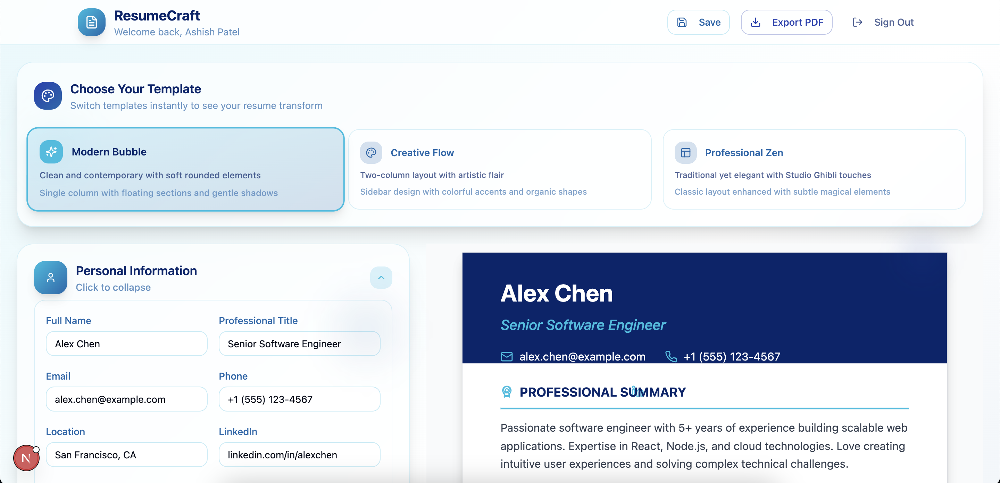
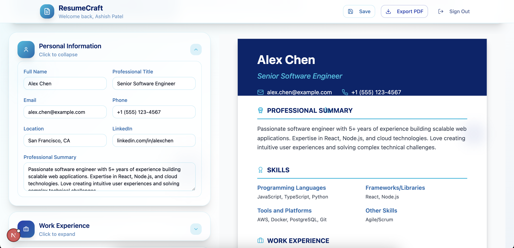
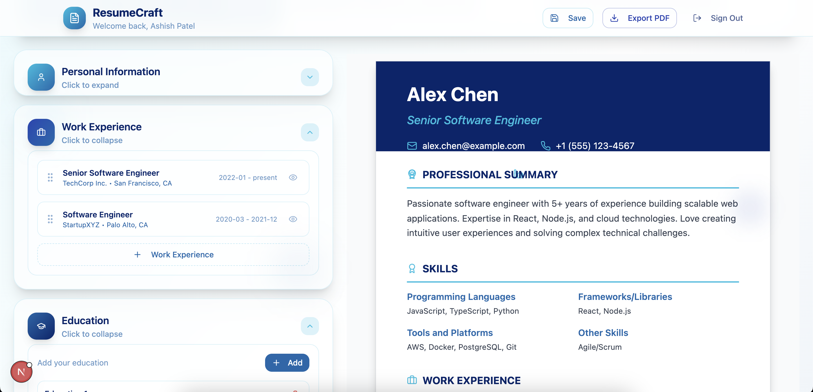
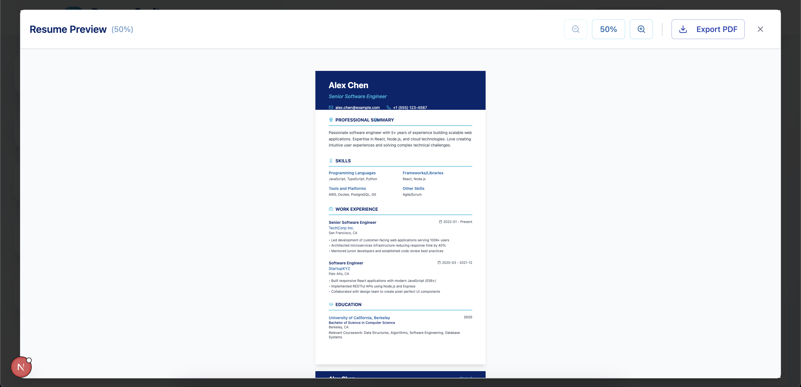
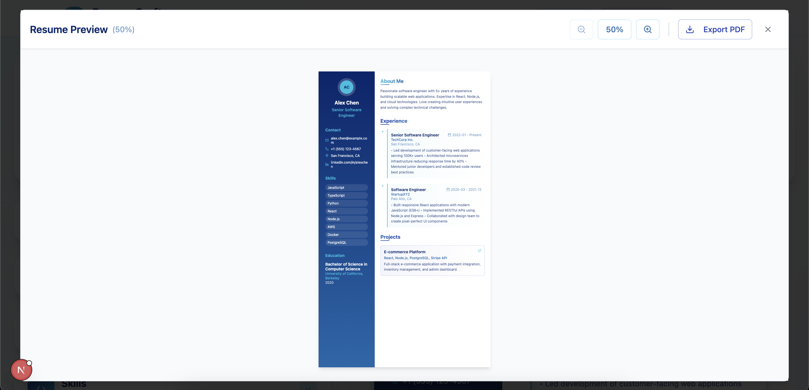

# ResumeCraft

> Craft professional resumes in minutes with an intuitive, live‑preview resume builder.

## 🚀 Live Demo

> \[View the live app at your-deployment-url.com]

## 📸 Screenshots

| Login Page                    | Google Sign-In                             | Landing Page                      |
| ----------------------------- | ------------------------------------------ | --------------------------------- |
|  |  |  |

| Resume Editor               | Drag & Drop Reorganize                        | Content Section              |
| --------------------------- | --------------------------------------------- | ---------------------------- |
|  |  |  |

| Resume Preview                      | Resume Preview (Alt)                   |
| ----------------------------------- | -------------------------------------- |
|  |  |

## ✨ Features

- **Google Authentication**: Secure sign‑in via Google accounts (powered by NextAuth.js).
- **Auto‑Save Magic**: Changes are saved instantly to localStorage—never lose your work.
- **Instant Templates**: Switch between **Modern Bubble**, **Creative Flow**, and **Professional Zen** with a single click.
- **Section‑Based Editor**: Fill out Personal Info, Experience, Education, Skills, and Projects in collapsible, drag‑and‑drop panels.
- **Live Preview**: See your resume rendered page‑by‑page with perfect letter‑size scaling.
- **PDF Export**: Download your resume as a print‑ready PDF.
- **Mobile‑Friendly**: Responsive layout for on‑the‑go edits.

## 🛠️ Installation & Setup

1. **Clone the repository**

   ```bash
   git clone https://github.com/yourusername/resumecraft.git
   cd resumecraft
   ```

2. **Install dependencies**

   ```bash
   npm install
   # or yarn install
   ```

3. **Setup environment variables**
   Create a `.env.local` file in the root:

   ```ini
   GOOGLE_CLIENT_ID=<your_google_client_id>
   GOOGLE_CLIENT_SECRET=<your_google_client_secret>
   NEXTAUTH_URL=http://localhost:3000
   ```

4. **Run the development server**

   ```bash
   npm run dev
   # or yarn dev
   ```

5. Open [http://localhost:3000](http://localhost:3000) in your browser.

## 📂 Project Structure

```
├── app/                  # Next.js App Router
│   ├── api/auth/...      # NextAuth route
│   ├── globals.css       # Tailwind base styles
│   ├── layout.tsx        # Root layout (Server Component)
│   └── page.tsx          # Client page with session logic
├── components/           # React components
├── contexts/             # Auth & Resume React Contexts
├── lib/                  # Utility functions
├── public/               # Static assets (e.g. screenshots)
├── styles/               # Tailwind CSS config overrides
├── .env.local            # Environment variables
├── next.config.mjs       # Next.js configuration
├── tailwind.config.ts    # Tailwind CSS config
└── README.md             # This file
```

## 📦 Technologies

- **Framework:** Next.js 15 (App Router)
- **Language:** React 19 + TypeScript
- **Authentication:** NextAuth.js (Google Provider)
- **Styling:** Tailwind CSS with shadcn/ui components
- **Icons:** lucide‑react
- **State Management:** React Context (resume data + session)
- **Utilities:** clsx, tailwind‑merge, date‑fns

## 🤝 Contributing

1. Fork the repository.
2. Create a feature branch: `git checkout -b feat/YourFeature`
3. Commit your changes: `git commit -m "feat: Add amazing feature"`
4. Push to your branch: `git push origin feat/YourFeature`
5. Open a Pull Request describing your changes.

## 📄 License

This project is licensed under the MIT License. See the [LICENSE](LICENSE) file for details.
